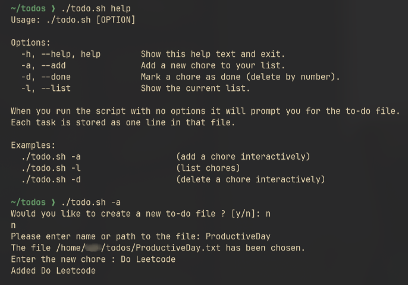

# To-do list

A simple to-do list script that:
* Creates a new `.txt` file or uses an existing one.
* Lets you **add**, **delete**, and **view** your chores.
---
## Preview



## Usage
Clone the repo or download the todo.sh file.
It is recommended that you create a new directory for todo.sh as well as the actual to-do lists, for simplicity.

Get started:

```bash
cd todos
chmod +x todo.sh       # make it executable
./todo.sh help         # show help/usage
./todo.sh -a           # add a chore (interactive)
./todo.sh -l           # view chores list
./todo.sh -d           # delete a chore (interactive)
```

The script will prompt you to create or select a to-do file on first run.
